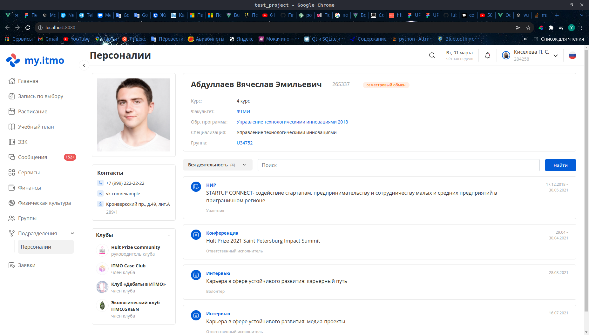

# test_project

## Страница персоналий



Для изменения типа пользователя измените параметр role в модуле userModule памяти Vuex. Возможные значаения:
* _employee_ - сотрудник
* _student_ - студент
* _teacher_ - преподаватель
* *student_employee* - студент+сотрудник

## Project setup
```
npm install
```

### Compiles and hot-reloads for development
```
npm run serve
```

### Compiles and minifies for production
```
npm run build
```

### Lints and fixes files
```
npm run lint
```

### Customize configuration
See [Configuration Reference](https://cli.vuejs.org/config/).
